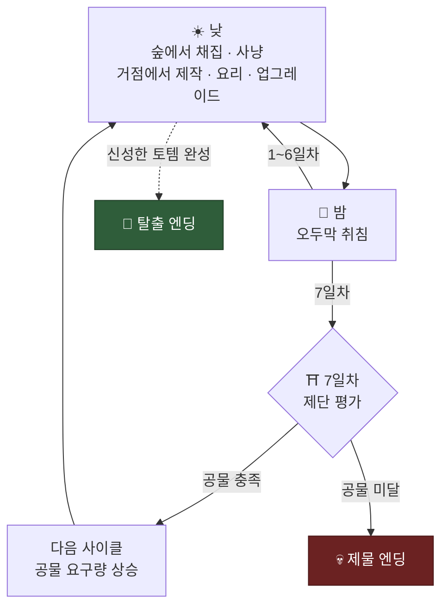

<div align="center">

# 🌲 7Days

**7일마다 공물을 준비하며 숲을 탐험하는 생존 게임**


<br><br>


</div>

---

## 게임 소개

**7Days**는 7일마다 요구되는 공물을 준비하며 숲을 탐험하는 3D 생존 제작 게임입니다.

플레이어는 낮 동안 숲에서 자원을 채집하고 동물을 사냥해 장비와 음식을 제작합니다.
한정된 자원을 공물에 사용할지, 거점을 업그레이드하는 데 투자할지 판단해야 합니다.

7일차까지 요구된 공물을 제출하면 다음 주기로 넘어가며, 주기가 반복될수록 필요한 공물의 가치도 높아집니다.
최종 목표는 **신성한 토템**을 완성해 숲에서 탈출하는 것입니다.

---

## 핵심 루프



<p align="center"></p>

---

## 주요 시스템

### 🪓 채집과 사냥

참나무, 바위, 덤불부터 석탄·철·금·다이아몬드·루비까지 **9종의 자원**이 숲에 흩어져 있습니다.
자원마다 체력이 있어 좋은 도구일수록 빨리 캡니다. 루비 광맥은 맨손으로는 답이 없습니다.

**18종의 동물**이 살고 있습니다. 토끼·양·여우처럼 도망치는 동물도 있고,
곰·사자·호랑이·악어처럼 **먼저 달려드는 동물**도 있습니다. 코뿔소와 악어는 체력 120.

<p align="center"></p>

### 🔨 제작과 요리

**작업대**에서 재료를 가공하고 장비를 만듭니다. **가마솥**에서는 요리를 합니다.
레시피는 **52종**, 대부분 단계식입니다 — 돼지꼬치와 채소스튜를 합쳐 고기 스튜, 거기서 다시 매운 스튜로.
제단에 바칠 봉헌품도 마찬가지로 토템 → 조각상/부적 → 레전드 순으로 올라갑니다.

<p align="center">
  
  
</p>

### ⬆️ 거점 업그레이드

모은 자원은 거점을 키우는 데도 들어갑니다.
이동 속도, 공격 속도, 낮 길이, 인벤토리와 저장소 칸, 숲의 자원·동물 리젠, 작업대와 가마솥 해금까지
**9개 라인**을 원하는 순서로 올립니다.

<p align="center"></p>

### ⛩️ 제단과 공물

7일차에 요구 목록을 채웠는지 평가합니다. 사이클이 넘어갈수록 요구는 무거워집니다.
부분 제출이 가능하니 며칠에 걸쳐 조금씩 채워도 됩니다.

<p align="center"></p>

### ❤️ 생존

체력과 배고픔이 따로 돕니다. 배를 채우지 못한 채 잠들면 다음 날이 고단해집니다.
체력 회복은 오두막 취침, 그리고 약초 수프나 신성한 국 같은 회복 요리로.

<p align="center"></p>

---

## 콘텐츠

| | |
|---|---|
| 아이템 | **88종** |
| 레시피 | **52종** |
| 동물 | **18종** (온순 10 / 적대 8) |
| 자원 | **9종** |
| 장비 | **17종** |
| 음식 | **31종** |
| 업그레이드 | **9라인** |
| 공물 요구 | **9세트** |

---

## 엔딩

| | |
|---|---|
| 🗿 **탈출** | 신성한 토템을 완성해 사용 |
| 💀 **제물** | 7일차에 공물 미달 |

---

## 다운로드

> 📱 **[APK 다운로드](링크)** · Android

---

## 기술 스택

| | |
|---|---|
| 엔진 | Unity **6000.3.15f1** |
| 렌더링 | Universal Render Pipeline 17.3.0 |
| 입력 | Input System 1.19.0 |
| 카메라 | Cinemachine 2.10.7 |
| AI | AI Navigation 2.0.12 (NavMesh) |
| 연출 | DOTween |

---

## 프로젝트 정보

| | |
|---|---|
| 장르 | 생존 · 탐험 · 제작 |
| 시점 | 3D 탑뷰 |
| 플랫폼 | Android |
| 인원 | 1인 개발 |
| 레퍼런스 | Don't Starve |

```
Assets/Scripts/
├── Data/          아이템 · 자원 · 동물 · 장비 · 음식 데이터
├── Map/           청크 기반 맵 생성
├── Player/        이동 · 상호작용 · 체력 · 배고픔 · 인벤토리
├── Craft/         제작 시스템
├── Cauldron/      요리 시스템
├── Upgrade/       거점 업그레이드
├── Tribute/       제단 · 공물 평가
├── Storage/       저장소
├── SaveLoad/      암호화 세이브
├── Tutorial/      튜토리얼 씬
└── UI/            HUD · 타이틀 · 엔딩
```
