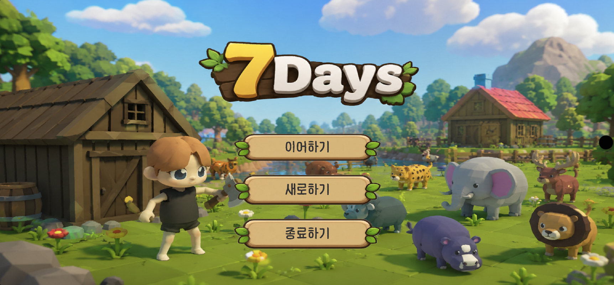
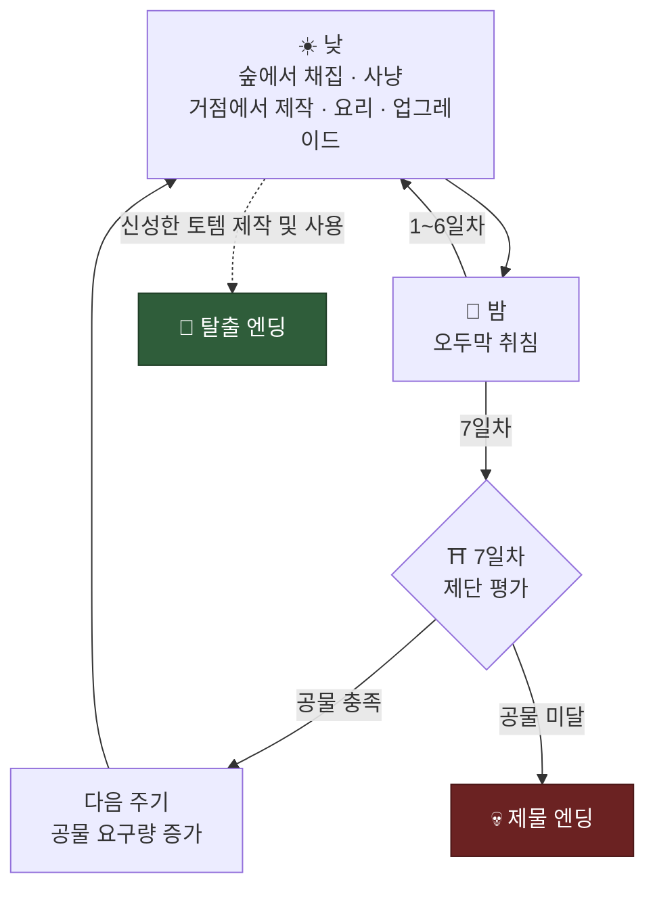
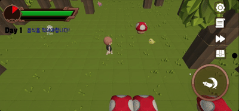
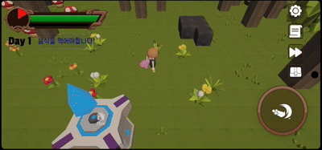
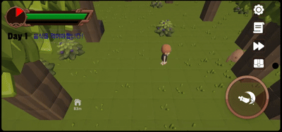
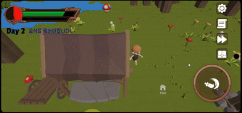
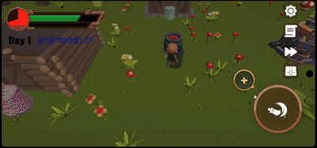

<div>

# 🌲 7Days

**7일마다 공물을 바치며 살아남고, 숲에서 탈출할 방법을 찾는 3D 생존 게임**




</div>

---

## 게임 소개

**7Days**는 숲에서 자원을 모아 7일마다 요구되는 공물을 바치고, 탈출을 준비하는 3D 생존 게임입니다.

낮에는 숲을 탐험하며 자원을 채집하고 동물을 사냥합니다.
모은 재료로 장비와 음식을 만들고, 거점을 강화해 다음 탐험을 준비할 수 있습니다.

하지만 모든 자원을 성장에 사용할 수는 없습니다. 7일차가 끝날 때까지 공물을 마련하지 못하면, 플레이어가 제물로 바쳐집니다.
한정된 자원을 공물로 바칠지, 거점 강화에 투자할지 선택해야 합니다.

주기가 반복될수록 요구되는 공물의 가치가 높아집니다.
생존과 성장 사이에서 자원을 배분하며, **신성한 토템을 제작하여 숲을 탈출하는 것**이 최종 목표입니다.

---

## 핵심 루프



<p align="center"></p>

---

## 주요 시스템

### 🪓 채집

숲에서는 나무, 바위, 덤불, 광물 등 **9종의 자원**을 채집할 수 있습니다.
자원마다 내구도가 있으며, 높은 등급의 도구를 사용하면 더 빠르게 채집할 수 있습니다.

<p align="center"></p>

### 🐾 사냥

숲에는 **18종의 동물**이 등장합니다.
플레이어를 피해 달아나는 동물도 있지만, 공격받으면 반격하는 동물도 있어 사냥할 때 주의가 필요합니다.

<table>
  <tr>
    <th>도망치는 동물</th>
    <th>반격하는 동물</th>
  </tr>
  <tr>
    <td></td>
    <td></td>
  </tr>
</table>

### 🔨 제작과 요리

**작업대**에서는 채집과 사냥으로 모은 재료를 가공해 장비와 공물 아이템을 제작하고,
**가마솥**에서는 다양한 음식을 만들 수 있습니다.

제작과 요리를 합쳐 총 **52종의 레시피**가 있습니다.
일부 상위 아이템은 다른 아이템을 먼저 제작한 뒤, 이를 재료로 사용해 완성해야 합니다.

<table>
  <tr>
    <th>작업대 제작</th>
    <th>가마솥 요리</th>
  </tr>
  <tr>
    <td></td>
    <td></td>
  </tr>
</table>

### ⬆️ 거점 업그레이드

모은 자원으로 플레이어의 능력을 강화하고 거점 시설을 확장할 수 있습니다.

이동 속도, 공격 속도, 낮의 지속 시간, 인벤토리 용량, 저장소 용량 등 **5개 항목**을 업그레이드할 수 있습니다.

<p align="center"></p>

### ⛩️ 제단과 공물

매 주기의 7일차가 끝나면, 제단에 바친 공물이 요구 조건을 충족했는지 판정합니다.
조건을 충족하면 다음 주기가 시작되고, 충족하지 못하면 제물 엔딩을 맞이합니다.

공물은 기한 내에 여러 번 나누어 바칠 수 있으며, 주기가 반복될수록 요구되는 공물 가치가 증가합니다.

<p align="center"></p>

### ❤️ 생존

살아남으려면 **체력과 배고픔**을 관리해야 합니다.
음식을 먹어 배를 채우고, 허기진 상태로 잠들지 않도록 주의해야 합니다.

체력은 오두막에서 잠을 자거나 회복 효과가 있는 음식을 먹어 회복할 수 있습니다.
단, 허기진 상태로 잠들면 취침 시 페널티를 받습니다.

<p align="center"></p>

---

## 콘텐츠

| 구분 | 콘텐츠 |
|---|---:|
| 아이템 | **88종** |
| 레시피 | **52종** |
| 동물 | **18종** |
| 자원 | **9종** |
| 장비 | **17종** |
| 음식 | **31종** |
| 업그레이드 | **5개 항목** |
| 공물 요구 목록 | **9세트** |

---

## 엔딩

| 엔딩 | 달성 조건 |
|---|---|
| 🗿 **탈출 엔딩** | 신성한 토템을 제작하고 사용 |
| 💀 **제물 엔딩** | 7일차 종료 시 공물 요구 조건을 충족하지 못함 |

---

## 다운로드

> 📱 **[Google Play에서 다운로드](https://play.google.com/store/apps/details?id=com.DevelRocket.SevenDays&hl=ko)** · Android

---

## 기술 스택

| | |
|---|---|
| 엔진 | Unity **6000.3.15f1** |
| 렌더링 | Universal Render Pipeline 17.3.0 |
| 입력 | Input System 1.19.0 |
| 카메라 | Cinemachine 2.10.7 |
| AI | AI Navigation 2.0.12 (NavMesh) |
| 연출 | DOTween |

---

## 프로젝트 정보

| | |
|---|---|
| 장르 | 생존 · 탐험 · 제작 |
| 시점 | 3D 탑뷰 |
| 플랫폼 | Android |
| 인원 | 1인 개발 |

---

## 프로젝트 구조

```text
Assets/Scripts/
├── Data/          아이템 · 자원 · 동물 · 장비 · 음식 데이터
├── Map/           청크 기반 맵 생성
├── Player/        이동 · 상호작용 · 체력 · 배고픔 · 인벤토리
├── Craft/         제작 시스템
├── Cauldron/      요리 시스템
├── Upgrade/       거점 업그레이드
├── Tribute/       제단 · 공물 평가
├── Storage/       저장소
├── SaveLoad/      암호화 세이브
├── Tutorial/      튜토리얼 씬
└── UI/            HUD · 타이틀 · 엔딩
```
